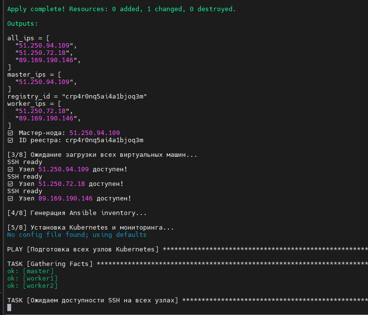
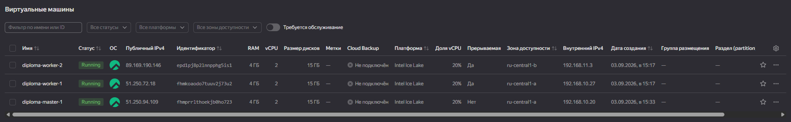
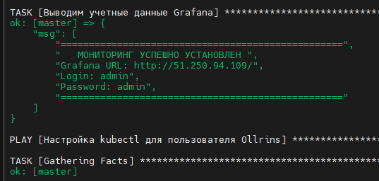
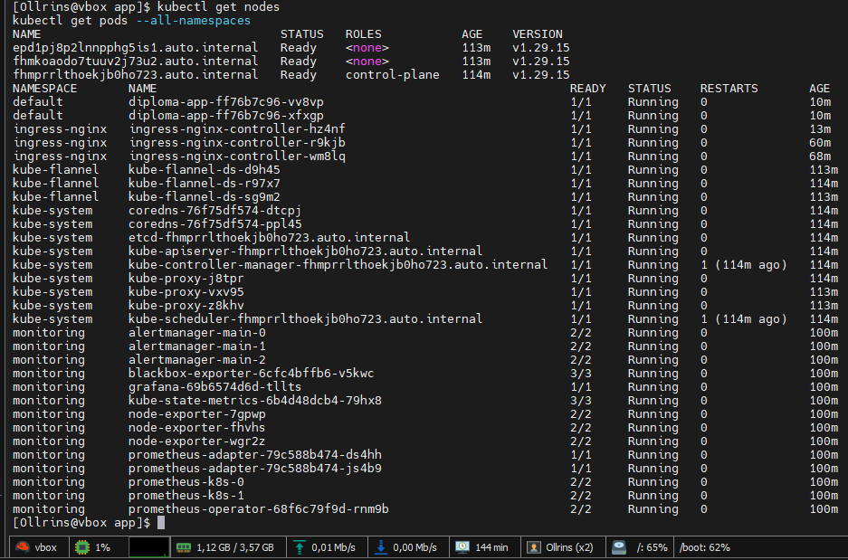
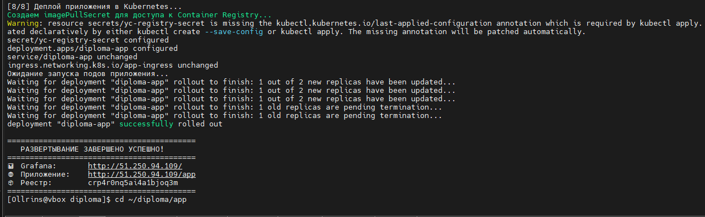
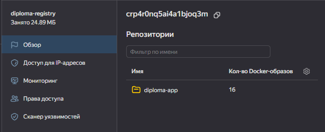
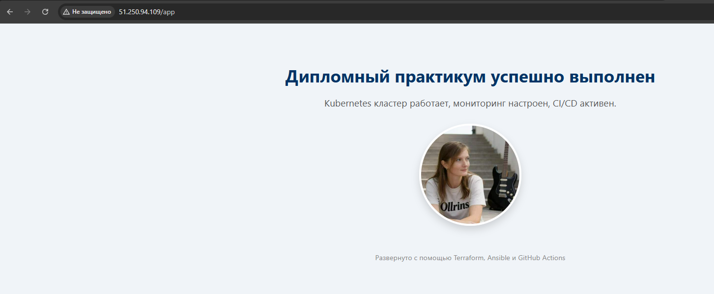
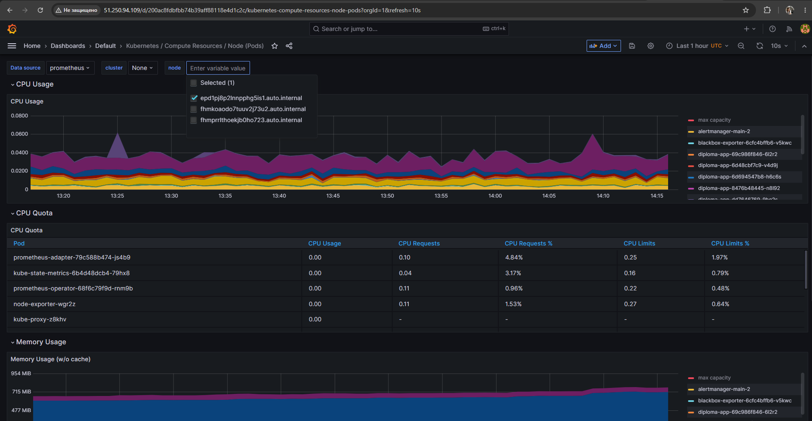

# Дипломный практикум: Развёртывание Kubernetes кластера в Yandex Cloud

## Задание 1. Создание инфраструктуры с помощью Terraform

### Файлы манифестов

## Структура проекта

### Шаг 1. Создание IAM ресурсов (Terraform)
- [terraform/iam/main.tf](terraform/iam/main.tf) - сервисный аккаунт, статические ключи, бакет для хранения state-файлов
- [terraform/iam/variables.tf](terraform/iam/variables.tf) - входные переменные модуля IAM
- [terraform/iam/providers.tf](terraform/iam/providers.tf) - конфигурация провайдера Yandex Cloud

### Шаг 2. Создание инфраструктуры (Terraform)
- [terraform/infra/main.tf](terraform/infra/main.tf) - VPC, подсети, ВМ master/workers, Container Registry, security groups
- [terraform/infra/variables.tf](terraform/infra/variables.tf) - входные переменные (ID облака, каталога, образ ВМ)
- [terraform/infra/cloud-init.yaml](terraform/infra/cloud-init.yaml) - скрипт начальной настройки ВМ

### Шаг 3. Установка Kubernetes кластера (Ansible)
- [ansible/playbook-rocky.yml](ansible/playbook-rocky.yml) - playbook установки Kubernetes, мониторинга и Ingress

### Шаг 4. Сборка Docker-образа и приложение
- [app/Dockerfile](app/Dockerfile) - описание образа приложения на базе nginx
- [app/index.html](app/index.html) - HTML-страница тестового приложения

### Шаг 5. Развёртывание приложения в Kubernetes
- [app/app-deployment.yaml](app/app-deployment.yaml) - Deployment (2 реплики), Service (ClusterIP), Ingress (путь /app)

### Шаг 6. Настройка CI/CD
- [github/workflows/deploy.yml](https://github.com/Ollrins/devops-diplom-yandexcloud/blob/main/.github/workflows/deploy.yml) - GitHub Actions workflow (build → push → deploy)

### Скрипты автоматизации
- [deploy-all.sh](deploy-all.sh) - скрипт полного развёртывания (Terraform + Ansible + Docker + K8s)
- [destroy-all.sh](destroy-all.sh) - скрипт безопасного удаления всех ресурсов

---

## Скриншоты

### Шаг 1. Создание инфраструктуры (Terraform)

    <em>Рисунок 1 - Вывод адресов из Terraform (master_ips, worker_ips, registry_id)</em> 

    <em>Рисунок 2 - Виртуальные машины с адресами в Yandex Cloud Console</em> 

### Шаг 2. Установка Kubernetes кластера (Ansible)

    <em>Рисунок 3 - Успешная установка мониторинга и учётные данные Grafana</em> 

    <em>Рисунок 4 - Все ноды Kubernetes в статусе Ready</em> 

    <em>Рисунок 5 - Завершение развёртывания и адрес Grafana</em> 

### Шаг 3. Сборка и публикация Docker-образа

    <em>Рисунок 6 - Docker-образ в Yandex Container Registry</em> 

### Шаг 4. Развёртывание приложения в Kubernetes

    <em>Рисунок 7 - Тестовое приложение доступно по адресу http://<IP>/app</em> 

### Шаг 5. Настройка мониторинга и Grafana

    <em>Рисунок 8 - Grafana дашборд с метриками Kubernetes кластера</em> 

---
